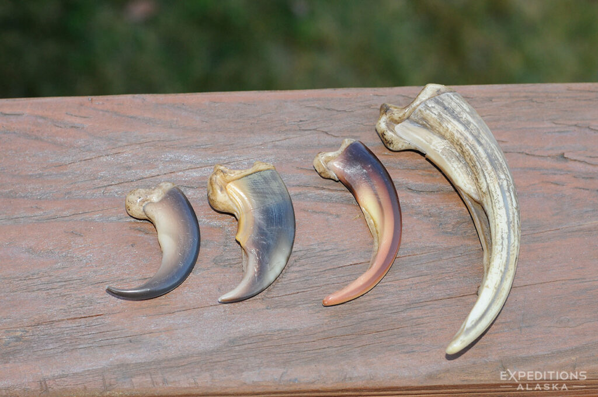
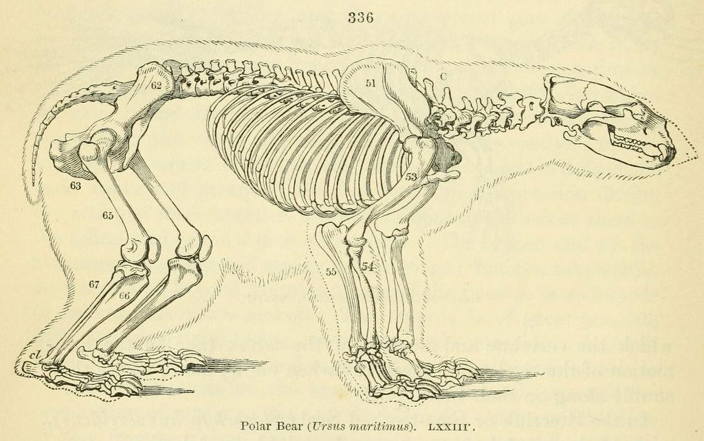

 
  

    

      <strong>Polar bears</strong> are the largest land carnivores and marine mammals uniquely adapted to life in the Arctic. With their distinctive white appearance and remarkable swimming abilities, they are perfectly suited for hunting seals on sea ice. However, climate change poses the greatest threat to their survival as melting ice reduces their hunting grounds.
    

  

  

  

    
  

## Habitat

  

    

      <strong>Circumpolar Arctic distribution:</strong> found throughout the Arctic and subarctic regions of Canada, Alaska (USA), Russia, Greenland, and Norway. Polar bears are <strong>sea-ice dependent</strong> – they spend most of their lives on Arctic sea ice hunting seals from ice and only come to land for denning or when the ice melts.
    

  

  

  

	
  

## Physical Traits

  

    

      <strong>Fur & Insulation:</strong> Double-layered coat – dense, transparent underfur plus long guard hairs over thick blubber. The fur appears white but is actually pigment-free and clear with black skin underneath that absorbs heat.
    

  

  

  

    
  

  

    
  

  

  

    

      <strong>Paws & Claws:</strong> Very large, furry-padded paws (~30 cm/12 in wide) distribute weight on ice and act as paddles in water. Claws are thick, curved (~5 cm/2 in long), and non-retractable – used to grip ice and catch prey.
    

  

  

    

      <strong>Head & Teeth:</strong> Slender head and long neck with a narrower skull and sloping "Roman" nose. Powerful jaws have large canine teeth for grasping seals and sharp cheek teeth for shearing meat.
    

  

  

  

    
  

## Diet

**Primary prey:** Almost exclusively carnivorous, feeding mainly on seals – especially ringed and bearded seals. Seals provide high-fat blubber essential for polar bear energy.

**Opportunistic feeding:** When sea ice is scarce, polar bears may eat carcasses or opportunistically consume birds, eggs, fish, vegetation, and even human refuse. However, terrestrial foods cannot replace the high-calorie seal blubber they require.

## Behavior

- **Solitary lifestyle:** Polar bears are largely solitary hunters; adults forage alone
- **Swimming ability:** Outstanding swimmers – can sustain ~6 mph in water and swim for days between ice floes
- **Mobility:** Can sprint briefly up to ~32 km/h (20 mph) when necessary
- **Senses:** Extremely keen sense of smell – can detect seals ~1 mile away or under several feet of snow

## Reproduction & Lifespan

  

    
  

  

  

    

      <strong>Breeding & Denning:</strong> Mating occurs in spring. Pregnant females build snow dens in late fall and give birth in mid-winter while hibernating. Births usually yield 1–2 cubs.
    

  

    

      <strong>Lifespan:</strong> In the wild polar bears live ~20–30 years (in captivity some have reached ~40+).
    

## Conservation Status

- **IUCN Red List:** Vulnerable (since 2006)
- **Threats:** Climate change is the greatest threat – warming melts sea ice earlier and refreezes it later, shortening the seal-hunting season
- **Population:** Global population estimated at ~22,000–31,000 bears